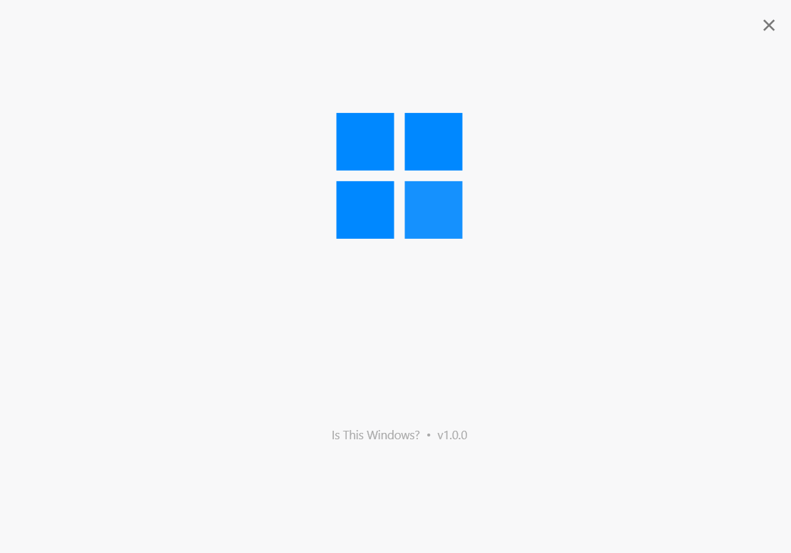
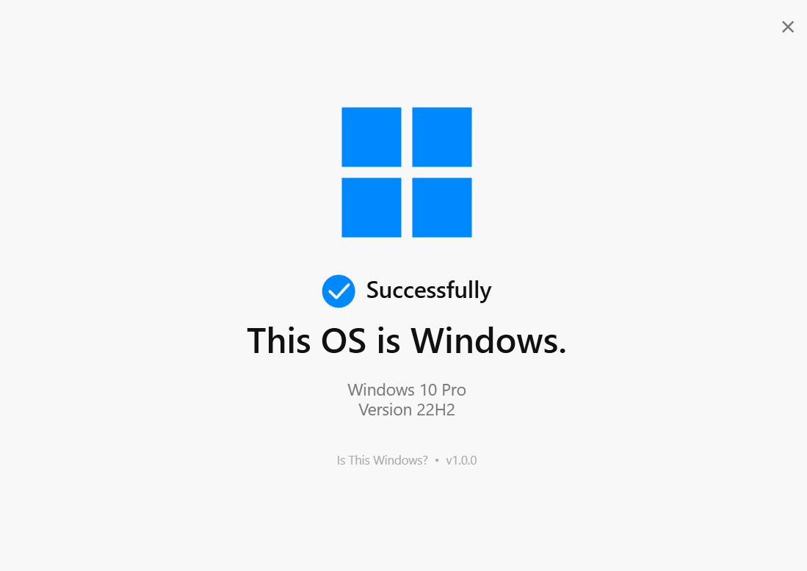

# Is This Windows?

> A highly advanced Windows detection utility.

It checks whether you're running Windows.

That's it.

---

## ✨ Overview

**Is This Windows?** is a Windows desktop application designed to answer one of the most fundamental questions in modern computing:

> **"Is this Windows?"**

The application launches, performs a system check, displays the detected Windows version, and gives you the answer.

Despite the simplicity of the task, the application takes the matter extremely seriously.

### The result

If you're running Windows:

> **This OS is Windows.**

If you're not:

> ...well, this application probably isn't running.

---

## 🖥️ Screenshots

### Main Screen



### Detection Result



---

## 🎬 PV

A short promotional video is available as part of the project presentation.

> What OS are you using right now?
>
> macOS? Linux?
>
> No, that's not right.
>
> We're using Windows.

---

## ✨ Features

### 🔍 Windows Detection

The application determines the installed Windows product information and displays it clearly.

For example:

```text
Windows 11 Pro
Version 25H2
````

### 🎨 Minimal Interface

A clean interface focused on one thing:

**finding out whether you're using Windows.**

No unnecessary dashboards.

No complicated settings.

No account system.

No cloud infrastructure.

Just Windows.

### 🎞️ Carefully Timed Animation

The application deliberately takes its time.

The detection itself is extremely simple.

The presentation is not.

The startup sequence includes:

* Window fade-in
* Windows logo animation
* Checkmark animation
* Text fade-in
* Result presentation

Because answering an important question deserves an appropriate amount of ceremony.

### 🪟 Native Windows Experience

Built as a native WPF desktop application for Windows.

It does not need a web browser.

It does not require an internet connection.

It does not require an account.

It simply runs.

---

## 🧠 Why does this exist?

Because we can.

There are countless applications designed to solve complicated problems.

This is not one of them.

**Is This Windows?** was created as an experiment in taking an absurdly simple idea and giving it an unnecessarily polished implementation.

The project intentionally focuses on:

* visual design
* animation
* typography
* native Windows UI
* software presentation
* branding
* documentation

The functionality is intentionally minimal.

The presentation is not.

---

## 🛠️ Technical Details

### Technology

| Component    | Technology          |
| ------------ | ------------------- |
| Framework    | .NET 8              |
| UI           | WPF                 |
| Language     | C#                  |
| Platform     | Windows             |
| Architecture | Win-x64             |
| Project Type | Desktop Application |

### How Windows information is detected

The application reads Windows product information from the system registry:

```text
HKEY_LOCAL_MACHINE
└── SOFTWARE
    └── Microsoft
        └── Windows NT
            └── CurrentVersion
```

The application uses values provided by Windows to determine information such as:

* Windows product name
* Windows display version

The result is then presented in the application UI.

---

## 📦 Installation

Download the latest release from the **Releases** section of this repository.

After downloading:

1. Extract the archive.
2. Run `IsThisWindows.exe`.
3. Wait for the extremely important detection process.
4. Receive the answer.

That's it.

---

## 🚀 Building from Source

### Requirements

* Windows
* .NET 8 SDK
* Windows desktop development environment

Clone or download this repository, then open a terminal in the project directory.

Build:

```bash
dotnet clean
dotnet build
```

Run:

```bash
dotnet run
```

---

## 📁 Project Structure

```text
IsThisWindows/
├── IsThisWindows.csproj
├── App.xaml
├── App.xaml.cs
├── MainWindow.xaml
├── MainWindow.xaml.cs
├── screenshots/
│   ├── main.png
│   └── result.png
└── README.md
```

---

## 🎯 Design Philosophy

The project follows one simple principle:

> **If you're going to make something pointless, make it good.**

The goal was not to create the most technically sophisticated Windows utility.

The goal was to make an intentionally simple concept feel like a real, carefully designed piece of software.

This means spending more effort on things that normally wouldn't need much effort:

* animations
* spacing
* typography
* visual hierarchy
* transitions
* branding
* documentation
* presentation

The application could have displayed:
```text
Windows detected.
```

and called it a day.

Instead, it decided to make an event out of it.

---

## 🪟 Why the Animation Is So Slow

Because it is funny.

The application already knows the answer.

Windows already knows the answer.

Your computer knows the answer.

You probably know the answer.

And yet...

**we're going to take a moment to make sure.**

---

## 🔒 Privacy

Is This Windows? does not require an internet connection to perform its detection.

The application does not require:

* an account
* cloud services
* external authentication
* email
* telemetry infrastructure

The Windows information displayed by the application is obtained locally.

---

## 📜 Version

**Current version: `v1.0.0`**

---

## ⚠️ Trademark Notice

Windows is a trademark of Microsoft Corporation.

This project is an unofficial application and is not affiliated with, sponsored by, or endorsed by Microsoft.

The use of Windows-related names and visual references in this project is intended for identification and presentation purposes only.

---

## 📄 License

The source code of this project is provided without an explicit open-source license.

Unless otherwise stated, no permission is granted to copy, modify, redistribute, or sublicense the source code.

Third-party trademarks remain the property of their respective owners.

---

## 🌐 Links

* **GitHub:** This repository
* **GitHub Pages:** Coming soon
* **PV:** Coming soon
* **Development Article:** Coming soon

---

## 💬 Final Words

There are many questions that modern software can answer.

What is the weather?

How fast is your internet?

How much storage do you have?

What is your CPU usage?

And now, finally:

# Is This Windows?

**Yes.**

Probably.

---
Built with .NET 8 and an unreasonable amount of effort.
